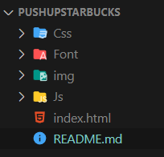
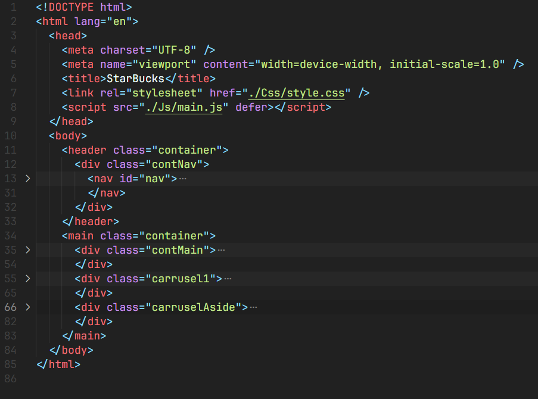
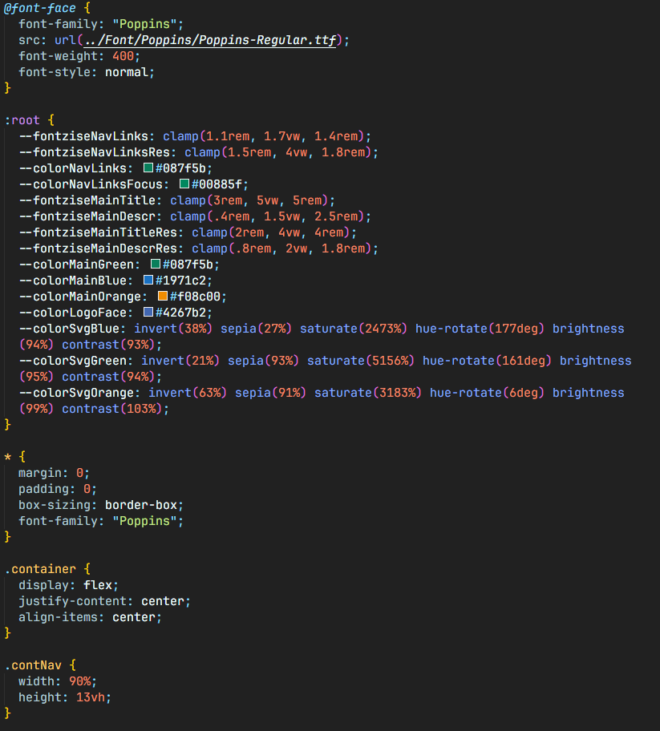
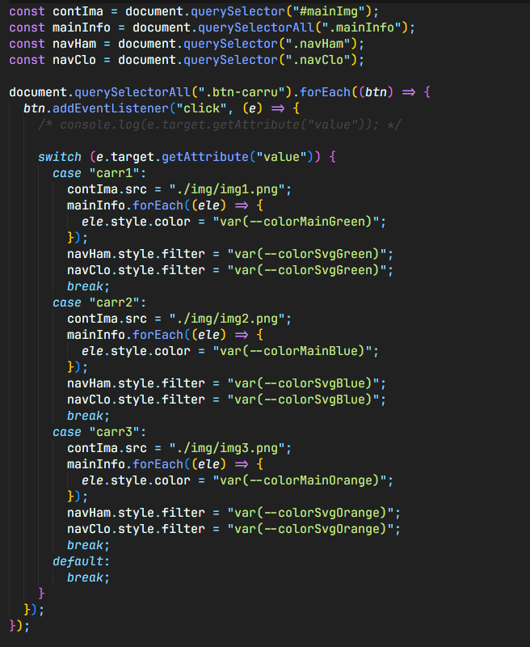

# PushUpStarbucks
> PushUpStarbucks frontend test, Diseñada por: William Villamizar Garcés

## Se crea la esturctura basica del proyecto

## Se crea la esturctura del index.Html

## Se aplican los estilos para el index.Html desde el archivo style.css

## Se crea un funcion en Javascript para cambiar stylos en los elementos del DOM
